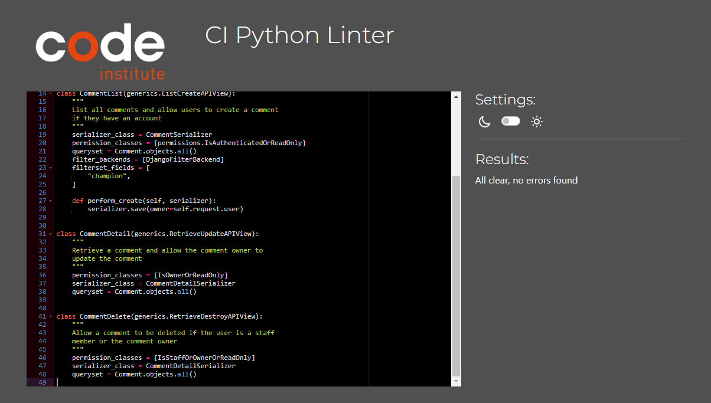
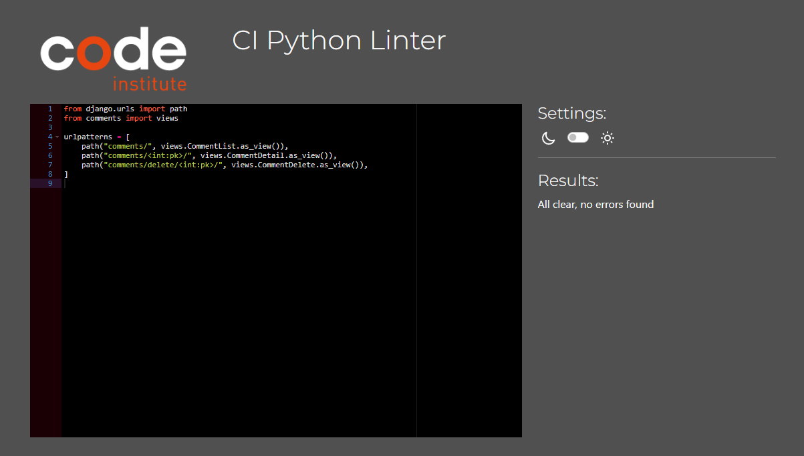

# **_League Hub - Django REST Framework API_**

This repository is the back-end REST API which is used by my front-end project, [League Hub](https://ci-league-hub.herokuapp.com/).

You can view the live site here - <a href="https://ci-league-hub.herokuapp.com/" target="_blank" rel="noopener">League Hub</a>

You can view the live API here - <a href="https://drf-api-league-hub.herokuapp.com/" target="_blank" rel="noopener">League Hub DRF API</a>

You can view the front-end README.md here - <a href="https://github.com/MikeR94/ci-project-portfolio-5" target="_blank" rel="noopener">League Hub Front-End README</a>

You can view the back-end README.md here - <a href="https://github.com/MikeR94/drf-api-league-hub" target="_blank" rel="noopener">League Hub Back-End README</a>

# Contents

- [**Objective**](#objective)
- [**Entity Relationship Diagram**](#entity-relationship-diagram)
- [**Database**](#database)
- [**Models**](#models)
- [**Testing**](#testing)
  - [**Manual Testing**](#manual-testing)
  - [**PEP8 Validation**](#pep8-validation)
  - [**Bugs Fixed**](#bugs-fixed)
  - [**Bugs Unresolved**](#bugs-unresolved)
- [**Technologies Used**](#technologies-used)
- [**Deployment To Heroku**](#deployment-to-heroku)
- [**Cloning This Project**](#cloning-and-setting-up-this-project)
- [**Credits**](#credits)
  - [**Content**](#content)
  - [**Media**](#media)
- [**Acknowledgments**](#acknowledgements)

# Objective

The objective of creating this API is to provide a fast, reliable and secure means of providing data to be used in my [League Hub](https://ci-league-hub.herokuapp.com/) front-end project. I aim to create simple, intuitive and purposeful models that will be used to represent the data required for the project. All API endpoints will serve a specific purpose and will be tested thoroughly to prevent any attempt to create/edit/delete any data without the correct permissions.

[Back to top](#contents)

# Entity Relationship Diagram

To create the entity relationship diagram, I used a graph modelling tool [Graph Models](https://django-extensions.readthedocs.io/en/latest/graph_models.html) which I used on my fourth project. It shows the entire relationship between all models in the database. After following the steps required to install Graph Models, I then used [dreampuf](https://dreampuf.github.io/GraphvizOnline/) to present the data in a clear and professional way. <br /><br />


[Back to top](#contents)

# Database

For this project, I implemented two databases.

The first one was the [SQLite](https://www.sqlite.org/index.html). This was used for the development side of the project and allows you to have a small, fast, self-contained SQL database engine.

The second database, which is a PostgreSQL database hosted by [ElephantSQL](https://www.elephantsql.com/) was used for the production database.

To visually see the data within both databases, I used an excellent, lightweight tool called [TablePlus](https://tableplus.com/) which allows me to see all the data instantly and modify the data if needed through UI if I ever need to.

### Production Database - Table Plus


### Development Database - Table Plus


[Back to top](#contents)

# Models

### Champions

The champions model is designed to contain all the relevant information regarding a League of Legends champion.

| Database Value               | Field Type    | Field Argument                                                |
| ---------------------------- | ------------- | ------------------------------------------------------------- |
| owner                        | ForeignKey    | User, on_delete=models.CASCADE                                |
| created_at                   | DateTimeField | auto_now_add=True                                             |
| updated_at                   | DateTimeField | auto_now=True                                                 |
| name                         | CharField     | max_length=255                                                |
| alias                        | CharField     | max_length=255                                                |
| champ_image                  | ImageField    | upload_to="images/", default="../Ivern_0_iumwtm", blank=False |
| lore                         | TextField     | blank=False                                                   |
| role                         | CharField     | max_length=32, choices=role_choices, blank=False              |
| champ_class                  | CharField     | max_length=32, choices=champ_class_choices, blank=False       |
| range                        | CharField     | max_length=32, choices=range_choices, blank=False             |
| difficulty                   | CharField     | max_length=32, choices=difficulty_choices, blank=False        |
| passive_ability              | CharField     | max_length=255                                                |
| passive_ability_description  | TextField     | blank=False                                                   |
| passive_ability_image        | ImageField    | upload_to="images/", default="../IvernW_muxhxj", blank=False  |
| ability_1                    | CharField     | max_length=255                                                |
| ability_1_description        | TextField     | blank=False                                                   |
| ability_1_image              | ImageField    | upload_to="images/", default="../IvernW_muxhxj", blank=False  |
| ability_2                    | CharField     | max_length=255                                                |
| ability_2_description        | TextField     | blank=False                                                   |
| ability_2_image              | ImageField    | upload_to="images/", default="../IvernW_muxhxj", blank=False  |
| ability_3                    | CharField     | max_length=255                                                |
| ability_3_description        | TextField     | blank=False                                                   |
| ability_3_image              | ImageField    | upload_to="images/", default="../IvernW_muxhxj", blank=False  |
| ultimate_ability             | CharField     | max_length=255                                                |
| ultimate_ability_description | TextField     | blank=False                                                   |
| ultimate_ability_image       | ImageField    | upload_to="images/", default="../IvernW_muxhxj", blank=False  |

```Python
role_choices = [
    ("top", "Top"),
    ("mid", "Mid"),
    ("jungle", "Jungle"),
    ("adc", "ADC"),
    ("support", "Support"),
]

champ_class_choices = [
    ("controller", "Controller"),
    ("fighter", "Fighter"),
    ("mage", "Mage"),
    ("marksman", "Marksman"),
    ("slayer", "Slayer"),
    ("tank", "Tank"),
    ("specialist", "Specialist"),
]

range_choices = [
    ("melee", "Melee"),
    ("ranged", "Ranged"),
]

difficulty_choices = [
    ("low", "Low"),
    ("moderate", "Moderate"),
    ("high", "High"),
]
```

### Comment

The comment model allows the user to create a comment on a champion. If a comment is deleted, it is deleted from both the User and Champion models

| Database Value | Field Type    | Field Argument                     |
| -------------- | ------------- | ---------------------------------- |
| owner          | ForeignKey    | User, on_delete=models.CASCADE     |
| champion       | ForeignKey    | Champion, on_delete=models.CASCADE |
| created_at     | DateTimeField | auto_now_add=True                  |
| updated_at     | DateTimeField | auto_now=True                      |
| comment        | TextField     |                                    |

### Profile

The profile model has a one-to-one relationship with the Django User model. This means that for every User that signs up to the website, there will be a corresponding Profile model which is used to define some additional values relative to the user. I've added a boolean field which will be used to determine if that user is a staff member or not. If this value is set to True then they will have staff permissions and will be able to perform all functionality of that of a staff member.

| Database Value | Field Type    | Field Argument                                       |
| -------------- | ------------- | ---------------------------------------------------- |
| owner          | OneToOneField | User, on_delete=models.CASCADE                       |
| created_at     | DateTimeField | auto_now_add=True                                    |
| updated_at     | DateTimeField | auto_now=True                                        |
| first_name     | CharField     | max_length=255, blank=True                           |
| last_name      | CharField     | max_length=255, blank=True                           |
| is_staff       | BooleanField  | default=False                                        |
| avatar_image   | ImageField    | upload_to="images/", default="../Amumu_0_wzmdhw.jpg" |

### Upvote

The upvote model is a small model that is used to store the upvotes for a champion. An upvote is a foreign key of both the User and Champion model and if the User or the Champion is ever deleted then any Upvotes related to either the User or the Champion will be deleted.

| Database Value | Field Type    | Field Argument                                             |
| -------------- | ------------- | ---------------------------------------------------------- |
| owner          | ForeignKey    | User, on_delete=models.CASCADE                             |
| champion       | ForeignKey    | Champion, on_delete=models.CASCADE, related_name="upvotes" |
| created_at     | DateTimeField | auto_now_add=True                                          |

[Back to top](#contents)

# Testing

- ## Manual Testing

| Application | Endpoint                  | Expected Result                                                                                                                                            | Pass/Fail |
| ----------- | ------------------------- | ---------------------------------------------------------------------------------------------------------------------------------------------------------- | --------- |
| Champions   | champions/                | Return a list of all the champions in the database ordered by name                                                                                         | Pass      |
| Champions   | champions/                | Searching for a champion by alphanumeric characters returns a list of matches                                                                              | Pass      |
| Champions   | champions/                | Applying a Top role filter returns only champions that have the role value of Top                                                                          | Pass      |
| Champions   | champions/                | Applying a Mid role filter returns only champions that have the role value of Mid                                                                          | Pass      |
| Champions   | champions/                | Applying a Jungle role filter returns only champions that have the role value of Jungle                                                                    | Pass      |
| Champions   | champions/                | Applying a ADC role filter returns only champions that have the role value of ADC                                                                          | Pass      |
| Champions   | champions/                | Applying a Support role filter returns only champions that have the role value of Support                                                                  | Pass      |
| Champions   | champions/<int:pk>/       | Returns a single champion with a correct ID and a list of all it's values                                                                                  | Pass      |
| Champions   | champions/<int:pk>/edit   | Returns a single champion with a correct ID and a list of all it's values and a staff member can edit the champion                                         | Pass      |
| Champions   | champions/<int:pk>/edit   | Returns a single champion with a correct ID and a list of all it's values and the owner can edit the champion                                              | Pass      |
| Champions   | champions/<int:pk>/edit   | Returns a single champion with a correct ID and a list of all it's values and a non-staff member can't edit the champion                                   | Pass      |
| Champions   | champions/<int:pk>/delete | Returns a single champion with a correct ID and a list of all it's values and a staff member can delete the champion                                       | Pass      |
| Champions   | champions/<int:pk>/delete | Returns a single champion with a correct ID and a list of all it's values and the owner can delete the champion                                            | Pass      |
| Champions   | champions/<int:pk>/delete | Returns a single champion with a correct ID and a list of all it's values and a non-staff member can't delete the champion                                 | Pass      |
| Champions   | champions/create          | Return a list of all the champions a staff member can create a new champion                                                                                | Pass      |
| Champions   | champions/create          | Return a list of all the champions a non-staff member can't create a champion                                                                              | Pass      |
| Comments    | comments/                 | Return a list of all the comments in order of creation date                                                                                                | Pass      |
| Comments    | comments/                 | Applying a Champion filter will return all the comments relating to that specific champion only                                                            | Pass      |
| Comments    | comments/<int:pk>/        | Returns a single comment with a correct ID and a list of all it's values                                                                                   | Pass      |
| Comments    | comments/<int:pk>/        | Returns a single comment with a correct ID and a list of all it's values and the owner can edit the comment                                                | Pass      |
| Comments    | comments/<int:pk>/        | Returns a single comment with a correct ID and a list of all it's values and if the user isn't the owner of the comment, they can't edit it                | Pass      |
| Comments    | comments/<int:pk>/        | Returns a single comment with a correct ID and a list of all it's values and even if the user is a staff member, they can't edit it                        | Pass      |
| Comments    | comments/delete/<int:pk>/ | Returns a single comment with a correct ID and a list of all it's values and if the owner of the comment can delete the comment                            | Pass      |
| Comments    | comments/delete/<int:pk>/ | Returns a single comment with a correct ID and a list of all it's values and if the user is a staff member, they can delete the comment                    | Pass      |
| Comments    | comments/delete/<int:pk>/ | Returns a single comment with a correct ID and a list of all it's values and if the user is not the owner of the comment, they can't delete it             | Pass      |
| Profiles    | profiles/                 | Returns a list of all the profiles in the database ordered by creation date                                                                                | Pass      |
| Profiles    | profiles/<int:pk>/        | Returns a single profile with a correct ID and a list of all it's values and if the user isn't the owner of the profile, they can't edit it                | Pass      |
| Profiles    | profiles/<int:pk>/        | Returns a single profile with a correct ID and a list of all it's values and if the user is the owner of the profile, they can edit it                     | Pass      |
| Profiles    | profiles/<int:pk>/        | Returns a single profile with a correct ID and a list of all it's values and if the user is a staff member, they can't edit it                             | Pass      |
| Upvotes     | upvotes/                  | Returns a list of all the current upvotes in the database                                                                                                  | Pass      |
| Upvotes     | upvotes/                  | If a user is logged in, they can make a post request to create an upvote for a champion                                                                    | Pass      |
| Upvotes     | upvotes/                  | If a user is logged in and they have already upvoted a champion and make a second post request to upvote it again, it fails with "Possible duplicate vote" | Pass      |
| Upvotes     | upvotes/                  | If a user is logged in and they have not already upvoted a champion and make a post request to upvote it, it succeeds and increases the upvote_count by 1  | Pass      |
| Upvotes     | upvotes/                  | If a user is logged out they are not able to upvote a champion                                                                                             | Pass      |
| Upvotes     | upvotes/<int:pk>/         | Returns a single upvote with a correct ID and a list of all it's values                                                                                    | Pass      |
| Upvotes     | upvotes/<int:pk>/         | If the user is the owner of the upvote, they can delete the upvote and it will delete it from the champion and decrease the upvote_count by 1              | Pass      |
| Upvotes     | upvotes/<int:pk>/         | If the user is not the owner of the upvote, they are unable to delete the upvote                                                                           | Pass      |
| Upvotes     | upvotes/<int:pk>/         | If the user is not the owner of the upvote but is a staff member, they are unable to delete the upvote                                                     | Pass      |

- ## PEP8 Validation

  I've tested all the files through the [CI PEP8 Linter](https://pep8ci.herokuapp.com/#) and although I found a few errors, I have rectified these and now all files are passing with "All clear, no errors found"

### drf_api_league_hub

**manage.py**


**wsgi.py**


**views.py**


**urls.py**


**settings.py**


**serializer.py**


**permissions.py**


### upvotes

**upvotes - views.py**


**upvotes - urls.py**


**upvotes - serializers.py**


**upvotes - models.py**


### profiles

**profiles - views.py**


**profiles - urls.py**


**profiles - serializers.py**


**profiles - models.py**


### comments

**comments - views.py**



**comments - urls.py**



**comments - serializers.py**


**comments - models.py**


### champions

**champions - views.py**


**champions - urls.py**


**champions - serializers.py**


**champions - models.py**


- ## Bugs Fixed

  ### Authenticated users deleting comments

  When conducting manual tests for the API endpoints, I encountered a small bug which allowed users to delete comments that were not theirs. Although I had handled this issue in the front end, locking down the back-end is the most suitable solution to prevent any malicious attempt to delete comments by directly targeting the API.

  The main problem was due to permissions. The comments/delete/<int:pk>/ endpoint was only checking if the user making the request was authenticated only.

  To fix this, I created a new permission which would check if the user making the request was either a staff member or the owner of the comment<br />

  

- ## Bugs Unresolved

  - As far as I'm aware, after extensive manual testing, I'm not aware of any unresolved bugs<br />

# Technologies Used

## Languages

- [Python](https://www.python.org/) - A programming language that lets you work quickly
  and integrate systems more effectively

## Libraries and Frameworks

- [Django](https://pypi.org/project/Django/) - Django is a high-level Python web framework that encourages rapid development and clean, pragmatic design.
- [Django REST Framework](https://pypi.org/project/djangorestframework/) - A powerful and flexible toolkit for building Web APIs

## Packages

- [asgiref](https://pypi.org/project/asgiref/) - A standard for Python asynchronous web apps and servers to communicate with each other,
- [black](https://pypi.org/project/black/) - A Python code formatter
- [certifi](https://pypi.org/project/certifi/) - For validating the trustworthiness of SSL certificates while verifying the identity of TLS hosts
- [charset-normalizer](https://pypi.org/project/charset-normalizer/) - A library that helps you read text from an unknown charset encoding
- [cloudinary](https://pypi.org/project/cloudinary/) - Easily integrate your application with Cloudinary
- [dj-database-url](https://pypi.org/project/dj-database-url/) - Allows you to utilize the 12factor inspired DATABASE_URL environment variable to configure your Django application.
- [dj-rest-auth](https://pypi.org/project/dj-rest-auth/) - API endpoints for handling authentication securely in Django Rest Framework
- [django-allauth](https://pypi.org/project/django-allauth/) - Integrated set of Django applications addressing authentication, registration, account management as well as 3rd party (social) account authentication
- [django-cloudinary-storage](https://pypi.org/project/django-cloudinary-storage/) - package that facilitates integration with Cloudinary by implementing Django Storage API
- [django-cors-headers](https://pypi.org/project/django-cors-headers/) - Adds Cross-Origin Resource Sharing (CORS) headers to responses.
- [django-extensions](https://pypi.org/project/django-extensions/) - Collection of global custom management extensions for the Django Framework.
- [django-filter](https://pypi.org/project/django-filter/) - Declaratively add dynamic QuerySet filtering from URL parameters.
- [django-rest-auth](https://pypi.org/project/django-rest-auth/) - Provides a set of REST API endpoints for Authentication and Registration
- [djangorestframework-simplejwt](https://pypi.org/project/djangorestframework-simplejwt/) - JSON Web Token authentication plugin for the Django REST Framework.
- [gunicorn](https://pypi.org/project/gunicorn/) - A Python WSGI HTTP Server for UNIX.
- [idna](https://pypi.org/project/idna/) - Support for the Internationalized Domain Names in Applications (IDNA) protocol
- [mypy-extensions](https://pypi.org/project/mypy-extensions/) - Defines extensions to the standard “typing” module that are supported by the mypy type checker and the mypyc compiler.
- [oauthlib](https://pypi.org/project/oauthlib/) - Implements the logic of OAuth1 or OAuth2 without assuming a specific HTTP request object or web framework.
- [pathspec](https://pypi.org/project/pathspec/) - Utility library for pattern matching of file paths
- [Pillow](https://pypi.org/project/Pillow/) - Adds image processing capabilities to your Python interpreter
- [psycopg2](https://pypi.org/project/psycopg2/) - PostgreSQL database adapter for Python
- [pycodestyle](https://pypi.org/project/pycodestyle/) - A tool to check your Python code against some of the style conventions in PEP 8.
- [pydot](https://pypi.org/project/pydot/) - Library to generate .dot files which can be used to show ERD's
- [PyJWT](https://pypi.org/project/PyJWT/) - Library for encoding and decoding JSON Web Tokens (JWT)
- [pyparsing](https://pypi.org/project/pyparsing/) - Python parsing module
- [pytz](https://pypi.org/project/pytz/) - Allows accurate and cross platform timezone calculations
- [requests](https://pypi.org/project/requests/) - Allows you to send HTTP/1.1 requests
- [requests-oauthlib](https://pypi.org/project/requests-oauthlib/) - OAuthlib authentication support for Requests
- [six](https://pypi.org/project/six/) - A Python 2 and 3 compatibility library
- [sqlparse](https://pypi.org/project/sqlparse/) - A non-validating SQL parser for Python. It provides support for parsing, splitting and formatting SQL statements.
- [urllib3](https://pypi.org/project/urllib3/) - A powerful, user-friendly HTTP client for Python

## Other Tools

- [VSCode](https://code.visualstudio.com/) - Used to create and edit the website.
- [GitHub](https://github.com/) - Used to host and deploy the website as well as manage the project.
- [GitBash](<https://en.wikipedia.org/wiki/Bash_(Unix_shell)>) - Terminal used to push changes to the GitHub repository.
- [Heroku](https://dashboard.heroku.com) - Used to deploy the website
- [SQLite](https://www.sqlite.org/index.html) - An open-source, zero-configuration, self-contained, stand-alone, transaction relational database engine designed to be embedded into an application.
- [ElephantSQL](https://www.elephantsql.com/) - Provides a browser tool for SQL queries where you can create, read, update and delete data directly from your web browser.
- [Cloudinary](https://cloudinary.com/) - Used to host all static files .
- [TablePlus](https://tableplus.com/) - Used to view databases in a clean, simple way.
- [Virutal Environment](https://docs.python.org/3/library/venv.html) - Used to create a virtual environment
- [Graph Models](https://django-extensions.readthedocs.io/en/latest/graph_models.html) - Used to generate a .dot file for all apps and models
- [dreampuf](https://dreampuf.github.io/GraphvizOnline/) - Used to present the .dot file in the form of a database diagram
- [CI PEP8 Linter](https://pep8ci.herokuapp.com/#) - Used to check the Python code for any linting issues

[Back to top](#contents)

# Deployment To Heroku

The project was deployed to [Heroku](https://www.heroku.com). The deployment process is as follows:

Firstly we need to create a new repository in [GitHub](https://github.com/) where our project files will be located

- Navigate to [GitHub](https://github.com/)
- Create a new repository with no template


Once you've created your new empty repository, we need to pull this repository down onto our local machine. Throughout the course I have used [VSCode](https://code.visualstudio.com/) to create and manage my projects instead of GitPod so I will be demonstrating the process with [VSCode](https://code.visualstudio.com/).

- Copy either the HTTPS or SSH URL that has just been generated by [GitHub](https://github.com/)

)

Now we need to open up a command prompt to pull this empty repository down onto our machine

- Open a CMD
- CD to a location you wish to store this project
- Now type **git clone https://github.com/MikeR94/drf-api-deployment-process.git**
- After the project has been pulled down onto your local machine, CD to the project and type **code .** to open the project with [VSCode](https://code.visualstudio.com/)

)

Now it's time to install Django and some additional packages

- Install Django by typing **pip install 'django<4'**
- Create our new project by typing **django-admin startproject drf_api_deployment_process .**
- Install cloudinary storage by typing **pip install django-cloudinary-storage**
- Install Pillow by typing **pip install Pillow**

Now we need to add our newly installed apps to our **settings.py** file


Next, create a new **env.py** file and paste in the following code - remembering to change the "YOUR CLOUDINARY URL HERE" part to your API key

```Python
import os

os.environ["CLOUDINARY_URL"] = "YOUR CLOUDINARY_URL_HERE"

```

Back in our **settings.py** file we need to import our **env.py** file if it exists

```Python
import os

if os.path.exists("env.py"):
    import env
```

Now we need to reference our new Cloudinary URL in **settings.py**

```Python
CLOUDINARY_STORAGE = {"CLOUDINARY_URL": os.environ.get("CLOUDINARY_URL")}
```

Now we need to define our MEDIA_URL and DEFAULT_FILE_STORAGE in **settings.py**

```Python
MEDIA_URL = "/media/"

DEFAULT_FILE_STORAGE = "cloudinary_storage.storage.MediaCloudinaryStorage"
```

Now it's time to start creating our applications. For my project I created 4 seperate applications

- **champions**
- **comments**
- **profiles**
- **upvotes**

Don't forget to add these applications to the INSTALLED_APPS variable in **settings.py**

After you have finished developing your application, you are ready to move onto the next deployment steps

First let's install JSON Web Token Authentication

- In the terminal type **pip install dj-rest-auth**

Add both rest framework’s auth token and django rest auth to INSTALLED APPS -

```Python
INSTALLED_APPS = [
    "rest_framework.authtoken",
    "dj_rest_auth",
]
```

Now add the urls to the urlpatterns list **path('dj-rest-auth/', include('dj_rest_auth.urls'))**

```Python
urlpatterns = [
    path("dj-rest-auth/", include("dj_rest_auth.urls")),
]
```

Now migrate the database by typing **python manage.py migrate**

Next install Django All Auth with the following command - **pip install 'dj-rest-auth[with_social]'** and add the new application to the INSTALLED_APPS vairable in **settings.py**

```Python
INSTALLED_APPS = [
    "django.contrib.sites",
    "allauth",
    "allauth.account",
    "allauth.socialaccount",
    "dj_rest_auth.registration",
]
```

Now add a SITE_ID variable in **settings.py**

```Python
SITE_ID = 1
```

Add the registration urls to the urlpatterns list

```Python
urlpatterns = [
    path('dj-rest-auth/registration/', include('dj_rest_auth.registration.urls')),
]
```

Now it's time to Add JWT tokens functionality, in the terminal type in the following command **pip install djangorestframework-simplejwt**

In **env.py** add the following variable

```Python
os.environ['DEV'] = '1'
```

In **settings.py** set the DEBUG value equal to the DEV variable you just set in **env.py**

```Python
DEBUG = 'DEV' in os.environ
```

Next, still in **settings.py** add the following code differentiate between development and production modes and also set the pagination and date time format

```Python
REST_PAGINATION = "rest_framework.pagination.PageNumberPagination"

REST_FRAMEWORK = {
    "DEFAULT_AUTHENTICATION_CLASSES": [
        (
            "rest_framework.authentication.SessionAuthentication"
            if "DEV" in os.environ
            else "dj_rest_auth.jwt_auth.JWTCookieAuthentication"
        )
    ],
    "DEFAULT_PAGINATION_CLASS": REST_PAGINATION,
    "PAGE_SIZE": 100,
    "DATETIME_FORMAT": "%d %b %Y",
}
```

And now add the following code to **settings.py** to enable token authentication, cookie declaration and to also ensure that the tokens are sent over HTTPS only

```Python
REST_USE_JWT = True
JWT_AUTH_SECURE = True
JWT_AUTH_COOKIE = "my-app-auth"
JWT_AUTH_REFRESH_COOKIE = "my-refresh-token"
JWT_AUTH_SAMESITE = "None"
```

Now we can create a new root route which will act as a welcome screen to anyone who visits the root route of our API

- Create a new **views.py** file in your main project folder (drf_api_league_hub) and add the following code

```Python
from rest_framework.decorators import api_view
from rest_framework.response import Response


@api_view()
def root_route(request):
    """
    Function to return a welcome message
    upon loading the API
    """
    return Response({"message": "Welcome to the League Hub DRF API!"})
```

Add that new route to the urlpatterns list in the main **urls.py** file

```Python
from .views import root_route

    path("", root_route),
```

Now it's time to create a new production database with [ElephantSQL](https://www.elephantsql.com/)

- Log into [ElephantSQL](https://www.elephantsql.com/)
- Click **Create New Instance**
- Give your plan a name
- Select \*_Tiny Turtle (Free)_ plan
- Click **Select Region** and pick a data center near you
- Click **Review**, double check the information you provided, once happy, click **Create Instance**

We need to get the new database URL from the [ElephantSQL](https://www.elephantsql.com/) dashboard.

Return to the dashboard, find your newly created plan and copy the URL


Back in our local project, in **eny.py** we can add our copied production database URL and store it in a new variable which can be referenced without exposing the value to unwanted eyes

```Python
os.environ.setdefault(
    "DATABASE_URL", "YOUR DB URL HERE",
)
```

In the terminal, type in **pip install dj_database_url**

After that has installed, we need to import it into our main **settings.py** file

```Python
import dj_database_url
```

Now we can seperate the development and production environment databases with the following code

```Python
if "DEV" in os.environ:
    DATABASES = {
        "default": {
            "ENGINE": "django.db.backends.sqlite3",
            "NAME": BASE_DIR / "db.sqlite3",
        }
    }
else:
    DATABASES = {"default": dj_database_url.parse(
        os.environ.get("DATABASE_URL"))}
    print("Connected to live database")
```

Next we need to install gunicorn. In the terminal, type in the following

- **pip install gunicorn**

Now created a Procfile at the root level in your project


Within that newly created Procfile, add the following code to let Heroku know how to run the project

```Python
release: python manage.py makemigrations && python manage.py migrate
web: gunicorn drf_api_league_hub.wsgi
```

Back in **settings.py**, we need to tell the project which hosts to allow

```Python
ALLOWED_HOSTS = [
    os.environ.get("ALLOWED_HOST"),
    "127.0.0.1",
]
```

Now it's time to install **CORS**

In the terminal, type in **pip install django-cors-headers** and then add it to the INSTALLED_APPS

```Python
INSTALLED_APPS = [
    'corsheaders',
]
```

Add it to the MIDDLEWARE list - it is important that it is placed at the top of the list

```Python
MIDDLEWARE = [
    "corsheaders.middleware.CorsMiddleware",
]
```

Now we need to set the ALLOWED_ORIGINS for the network requests made to the server. In **settings.py** file, add the below

```Python
if "CLIENT_ORIGIN" in os.environ:
    CORS_ALLOWED_ORIGINS = [
        os.environ.get("CLIENT_ORIGIN"),
    ]
if "CLIENT_ORIGIN_DEV" in os.environ:
    CORS_ALLOWED_ORIGINS.append(os.environ.get("CLIENT_ORIGIN_DEV"))

CORS_ALLOW_CREDENTIALS = True

JWT_AUTH_SAMESITE = 'None'
```

Now we need to replace the SECRET_KEY variable in **settings.py** to reference the secret key that we will create in **env.py**

In **env.py** create a new variable called SECRET_KEY and give it a value

```Python
os.environ.setdefault("SECRET_KEY", "YOUR SECRET KEY HERE")
```

Now back in **settings.py**, change the SECRET_KEY value to point to the SECRET_KEY you just created in **env.py**

```Python
SECRET_KEY = os.getenv("SECRET_KEY")
```

Update the requirements file by typing in the command in the terminal **pip freeze > requirements.txt**

- git add
- git commit -m "{message here}
- git push

Now it's time to deploy our new project live for everyone to see on [Heroku](https://www.heroku.com)

- Navigate to [Heroku](https://www.heroku.com)
- Click **New app**
- Fill in the relevant information
- Click **Create app** once you are happy


Once you've created your new [Heroku](https://www.heroku.com) application, we need to add some config variables. Click the **settings** tab and then click **Reveal Config Vars**

Make sure to add the following config variables

- ALLOWED_HOST - This is the URL of your deployed project (without the https)
- CLIENT_ORIGIN - This is the URL of your deployed front-end project
- CLIENT_ORIGIN_DEV - This is the URL when developing locally
- CLOUDINARY_URL - This is your Cloudinary API key
- DATABASE_URL - This is your production database URL
- DISABLE_COLLECTSTATIC - This will be removed before submission
- SECRET_KEY - This is the secret key you have created


Now we need to link our [Heroku](https://www.heroku.com) application with our [GitHub](https://github.com/) project

- Click the **Deploy** tab
- Choose **GitHub**
- Search for your repository
- Once found, click **Connect**


Finally, we can deploy our connected projected for everyone to see.

You can either choose **Enable Automatic Deploys** or **Deploy Branch**. I chose to deploy my application manually when I was ready instead of automatic deployments

- Click **Deploy Branch** and wait for it to build


[Back to top](#contents)

# Credits

### Content

This project was created and inspired by following the [Code Institute](https://codeinstitute.net/) DRF-API walkthrough and has been modified to meet the League Hub's demands

I spent some time looking through the official [Django REST Framework Documentation](https://www.django-rest-framework.org/api-guide/permissions/) to help me further understand some concepts, especially the permissions one where I needed to create a new **IsStaffOrOwnerOrReadOnly** permission

All the champion data stored in the database has been sourced from the official [League of Legends](https://www.leagueoflegends.com/en-gb/champions/) website

[Back to top](#contents)

# Acknowledgments

I have thoroughly enjoyed developing this project and although I found React to be challenging learning curve, after much perseverance I feel like I have a good baseline knowledge when it comes to developing applications that use an advanced front-end framework like React that talk to a back-end API developed using the Django REST Framework.
Unlike my other projects which I was able to work on full time, I had successfully landed a software developer job and I only had time to work on this project in my spare time whilst trying to have a balanced personal life. This was extremely challenging for myself, and I am very proud to have managed to finally submit my fifth and final project with [Code Institute](https://codeinstitute.net/)

I would like to thank my mentor Marcel, my educator Luke Walters, my brother Jack Ralph, my partner Beth, the Slack community, and all at the [Code Institute](https://codeinstitute.net/) for their help and support.

It has been an incredible journey and I’m extremely excited to see where this adventure will take me.

Thank you so much for a fantastic experience [Code Institute](https://codeinstitute.net/)!

Mike Ralph 2023.

[Back to top](#contents)
